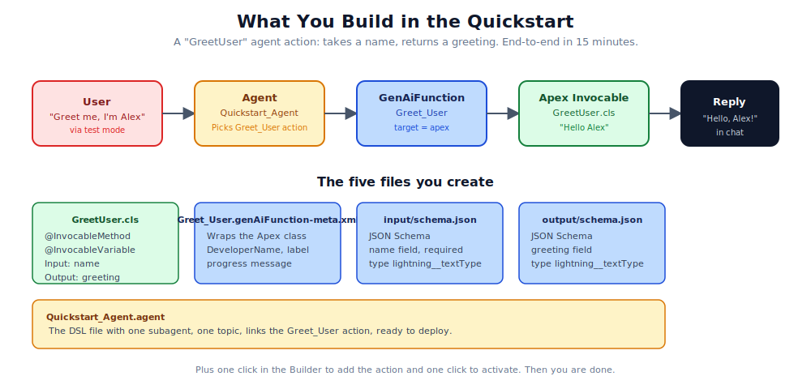

# 00. Quickstart

This is the fastest path I know to a working Agentforce custom action. Fifteen minutes if you already have a scratch org and the Salesforce CLI installed. Half an hour if you do not.

We will build a tiny agent with one custom action called `Greet_User`. It takes a name, returns a greeting. The point is not the agent's behaviour. The point is that you walk through every layer of the platform once, so the rest of the field guide makes sense in your bones.



## What you need before you start

- A Salesforce scratch org. The Developer Edition orgs work too, but scratch orgs are easier to throw away.
- Salesforce CLI version 2.0 or later. Check with `sf --version`.
- A code editor. Anything that handles XML and JSON is fine.

## Step 1. Create a scratch org

If you already have one with Agentforce features, skip this step. Otherwise, this gets you a fresh org with everything turned on.

```bash
sf org create scratch \
  --definition-file config/project-scratch-def.json \
  --alias quickstart \
  --duration-days 7 \
  --set-default
```

Use the scratch definition from this guide's templates if you do not have one. It enables Agentforce features and sets the API version.

## Step 2. Write the Apex invocable

Create `force-app/main/default/classes/GreetUser.cls`:

```apex
public with sharing class GreetUser {
    public class GreetInput {
        @InvocableVariable(label='Name' description='User name to greet' required=true)
        public String name;
    }

    public class GreetOutput {
        @InvocableVariable(label='Greeting' description='Greeting text')
        public String greeting;
    }

    @InvocableMethod(
        label='Greet User'
        description='Returns a personalised greeting for the given name.'
        category='Quickstart'
    )
    public static List<GreetOutput> greet(List<GreetInput> inputs) {
        List<GreetOutput> outputs = new List<GreetOutput>();
        for (GreetInput input : inputs) {
            GreetOutput output = new GreetOutput();
            output.greeting = 'Hello, ' + input.name + '!';
            outputs.add(output);
        }
        return outputs;
    }
}
```

And the metadata XML at `force-app/main/default/classes/GreetUser.cls-meta.xml`:

```xml
<?xml version="1.0" encoding="UTF-8"?>
<ApexClass xmlns="http://soap.sforce.com/2006/04/metadata">
    <apiVersion>62.0</apiVersion>
    <status>Active</status>
</ApexClass>
```

Deploy:

```bash
sf project deploy start -d force-app/main/default/classes/GreetUser.cls -o quickstart
```

## Step 3. Sanity-check the Apex via REST

Before going anywhere near the agent, confirm the action is callable:

```bash
TOK=$(sf org display -o quickstart --json | python3 -c 'import json,sys;print(json.load(sys.stdin)["result"]["accessToken"])')
INSTANCE=$(sf org display -o quickstart --json | python3 -c 'import json,sys;print(json.load(sys.stdin)["result"]["instanceUrl"])')

curl -X POST -H "Authorization: Bearer $TOK" -H "Content-Type: application/json" \
  "$INSTANCE/services/data/v62.0/actions/custom/apex/GreetUser" \
  -d '{"inputs":[{"name":"Alex"}]}'
```

You should get `{"isSuccess": true, "outputValues": {"greeting": "Hello, Alex!"}}`.

If this does not work, fix it before going further. Every later step depends on the Apex being right.

## Step 4. Create the GenAiFunction

Two ways to do this. The UI is faster the first time. The metadata files are reproducible across environments.

### UI path

1. Open Setup, search for "Agent Actions".
2. Click "New Agent Action".
3. Reference Action Type = Apex.
4. Reference Action Category = Invocable Method.
5. Reference Action = `GreetUser`.
6. Agent Action Label = `Greet User`.
7. Agent Action API Name = `Greet_User`.
8. Description: `Returns a friendly greeting for a given name.`
9. Map the input `Name` and output `Greeting`. Save.

### Metadata path

Create `force-app/main/default/genAiFunctions/Greet_User/Greet_User.genAiFunction-meta.xml`:

```xml
<?xml version="1.0" encoding="UTF-8"?>
<GenAiFunction xmlns="http://soap.sforce.com/2006/04/metadata">
    <description>Returns a friendly greeting for a given name.</description>
    <developerName>Greet_User</developerName>
    <invocationTarget>GreetUser</invocationTarget>
    <invocationTargetType>apex</invocationTargetType>
    <isConfirmationRequired>false</isConfirmationRequired>
    <isIncludeInProgressIndicator>true</isIncludeInProgressIndicator>
    <localDeveloperName>Greet_User</localDeveloperName>
    <masterLabel>Greet User</masterLabel>
    <progressIndicatorMessage>Saying hello</progressIndicatorMessage>
</GenAiFunction>
```

Plus `force-app/main/default/genAiFunctions/Greet_User/input/schema.json`:

```json
{
  "required": ["name"],
  "unevaluatedProperties": false,
  "properties": {
    "name": {
      "title": "Name",
      "description": "User name to greet",
      "lightning:type": "lightning__textType",
      "lightning:isPII": false,
      "copilotAction:isUserInput": true
    }
  },
  "lightning:type": "lightning__objectType"
}
```

And `force-app/main/default/genAiFunctions/Greet_User/output/schema.json`:

```json
{
  "unevaluatedProperties": false,
  "properties": {
    "greeting": {
      "title": "Greeting",
      "description": "Greeting text",
      "lightning:type": "lightning__textType"
    }
  },
  "lightning:type": "lightning__objectType"
}
```

Deploy:

```bash
sf project deploy start -d force-app/main/default/genAiFunctions/Greet_User -o quickstart
```

## Step 5. Create or open the agent in Builder

In the org, navigate to Agent Studio. Create a new agent called "Quickstart Agent" if one does not already exist. The Builder will scaffold a default conversation.

In the Builder, find the topic where the agent should be able to greet (any topic works for this exercise). Click "Add Action", select "Greet User", save.

If you want to author from source instead, drop a `.agent` file in `force-app/main/default/aiAuthoringBundles/Quickstart_Agent/` using the templates folder of this guide as a starting point.

## Step 6. Activate the agent

In the Builder header, click "Activate". This is the step everyone forgets. Without it, the runtime registry will not see the action and you will get the dreaded "Action name not found" error.

## Step 7. Test mode

Open the agent's test surface. Type "Greet me, my name is Alex". The agent should reply with "Hello, Alex!" or some variation.

If something goes wrong, jump to [Chapter 5: Troubleshooting](./05-troubleshooting.md) and walk through the layered checks.

## What you have at this point

- An Apex `@InvocableMethod` that runs deterministic code.
- A `GenAiFunction` record that registers it as an agent-callable action.
- An agent that knows about the action via a topic linkage.
- An activated runtime version that can answer test-mode prompts.

That is the entire architecture. Everything else in the field guide is variations on this pattern, plus the operational discipline that keeps it working as the system grows.

## Next steps

- Read [Chapter 1: The Mental Model](./01-mental-model.md) to understand why this works.
- Look at the [Cookbook](./cookbook/) for richer examples, including flows, prompt templates, and actions with callouts.
- Run through the [Starting Checklist](./02-starting-checklist.md) before building your next action.
- Skim [Chapter 7: Anti-Patterns](./07-anti-patterns.md) to avoid the obvious traps.

If you got stuck, the [Troubleshooting](./05-troubleshooting.md) chapter has the layered probes that will show you where the wiring broke.

## References

- [Apex `@InvocableMethod` annotation](https://developer.salesforce.com/docs/atlas.en-us.apexcode.meta/apexcode/apex_classes_annotation_InvocableMethod.htm)
- [Apex `@InvocableVariable` annotation](https://developer.salesforce.com/docs/atlas.en-us.apexcode.meta/apexcode/apex_classes_annotation_InvocableVariable.htm)
- [Metadata API: `GenAiFunction`](https://developer.salesforce.com/docs/atlas.en-us.api_meta.meta/api_meta/meta_genaifunction.htm)
- [Metadata API: `AiAuthoringBundle`](https://developer.salesforce.com/docs/atlas.en-us.api_meta.meta/api_meta/meta_aiauthoringbundle.htm) (introduced API v65)
- [REST: Invoke a custom Apex action](https://developer.salesforce.com/docs/atlas.en-us.api_rest.meta/api_rest/resources_actions_invocable_custom.htm)
- [Salesforce CLI: `sf project deploy start`](https://developer.salesforce.com/docs/atlas.en-us.sfdx_cli_reference.meta/sfdx_cli_reference/cli_reference_project_commands_unified.htm)
- [Agentforce: Get Started](https://developer.salesforce.com/docs/einstein/genai/guide/get-started-agents.html)

For the full canonical index, see [REFERENCES.md](./REFERENCES.md). For verification status, see [VERIFICATION.md](./VERIFICATION.md).
