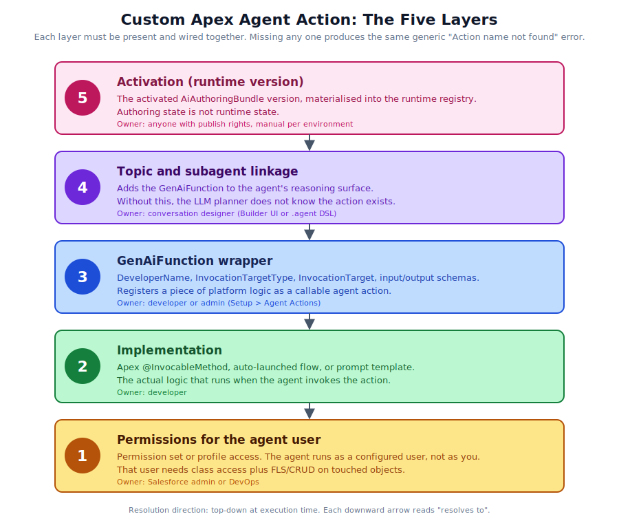
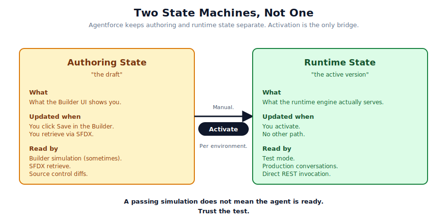
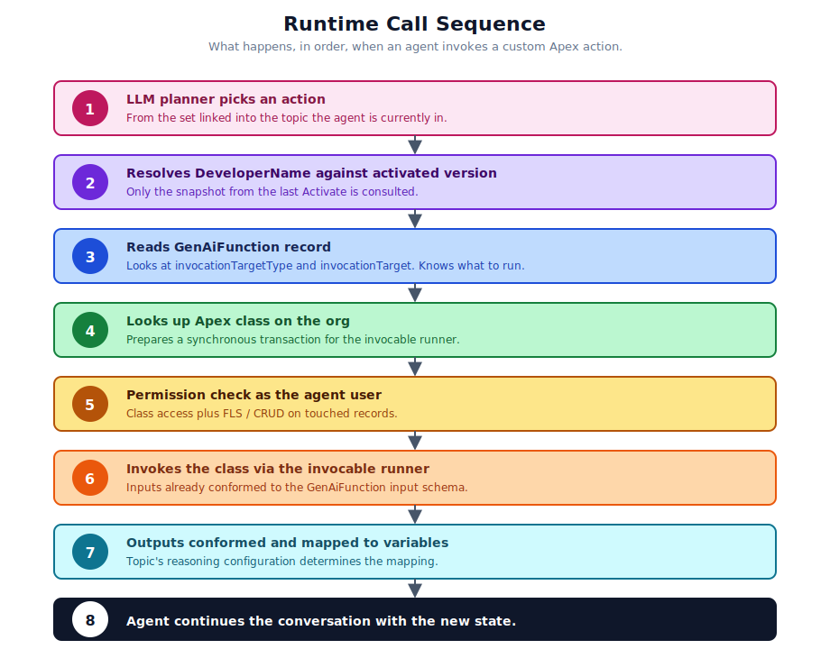

# 01. The Mental Model

Before you write a line of code, hold this picture in your head. Almost every difficult Agentforce bug we have seen comes from someone reasoning about the platform as if it had two layers when it actually has five.

## Five layers

## What each layer is responsible for

| Layer | Concrete artifact | Owned by |
|-------|-------------------|----------|
| 1, permissions | Permission sets, profiles, sharing rules | Salesforce Admin or DevOps |
| 2, implementation | Apex class, flow, prompt template | Developer |
| 3, GenAiFunction | `GenAiFunction` metadata record (`.genAiFunction-meta.xml` plus input/output JSON Schemas) | Developer or admin via Setup UI |
| 4, topic linkage | Entry in the `.agent` file's topic or subagent block, or "Add Action to Topic" in the Builder | Conversation designer |
| 5, activation | Runtime snapshot of the agent | Anyone with publish rights, manually per env |

The reason this matters is that **the failure mode of every layer looks like the failure of every other layer.** When the runtime cannot resolve an action, you see the same error whether the Apex class is missing, the wrapper is missing, the linkage is missing, or the agent is not activated. The layered model gives you a structured way to ask "which one is it?".

## Two state machines, not one

There is a second mental model that goes alongside the layers. Agentforce keeps two parallel state machines for an agent.

- **Authoring state.** What the Builder UI shows you. What gets saved when you click Save. What gets retrieved by `sf project retrieve start`.
- **Runtime state.** What the runtime engine actually serves. Updated only when you activate the agent.

Most platforms collapse these into one. Agentforce keeps them separate so that ongoing conversations are not broken by edits in flight. The split is a feature, but it has a sharp edge: simulation in the Builder may resolve some things from authoring state, while test mode and production both resolve from runtime. So you can save your changes, see a passing simulation, and watch test mode fail with no apparent explanation.

The fix is to activate. The trick is remembering to.

## What "calls a custom action" actually does at runtime

When the agent decides to call your action, the runtime executes a sequence that looks like this.

Every step in that sequence corresponds to one of the five layers. If you ever need to argue from first principles about why something does not work, walk through the steps. The layer that breaks tells you which step failed.

## Where Salesforce conventions surprise people

A few specifics that catch experienced engineers from other platforms:

- **The agent user is a real user.** Not a service principal, not a JWT, not a generated identity. It has a profile, a username, and a password. Permission is administered as if it were a person.
- **Activation is not deployment.** Deploying agent metadata does not switch the runtime to use the new version. The deploy succeeds, the runtime continues to use the previous active version, and you have to click Activate (or run a separate manual step) to promote.
- **Schema versioning is implicit.** Every time you change a `GenAiFunction`'s input or output, the runtime treats it as a new contract. There is no explicit version number that you bump. So a careless change to a field can quietly break callers.
- **The same generic error message covers many distinct failures.** This is a feature of how Agentforce isolates the LLM from infrastructure detail. It is also why a layered triage discipline is so important.

## The single most useful question

When something is failing, the most productive first question is not "what is the error?" but "which layer am I dealing with?". The error message will not tell you. The triage steps in [Chapter 5](./05-troubleshooting.md) will.

## References

- [Agentforce Developer Guide](https://developer.salesforce.com/docs/ai/agentforce/guide/)
- [Agent Metadata directory layout](https://developer.salesforce.com/docs/ai/agentforce/guide/agent-dx-metadata.html)
- [Metadata Types reference](https://developer.salesforce.com/docs/ai/agentforce/references/agents-metadata-tooling/agents-metadata.html)
- [Bot and BotVersion (legacy)](https://developer.salesforce.com/docs/atlas.en-us.api_meta.meta/api_meta/meta_bot.htm)
- [Agentforce Builder (Trailhead)](https://trailhead.salesforce.com/content/learn/modules/new-agentforce-builder-quick-look/explore-the-new-agentforce-builder)
