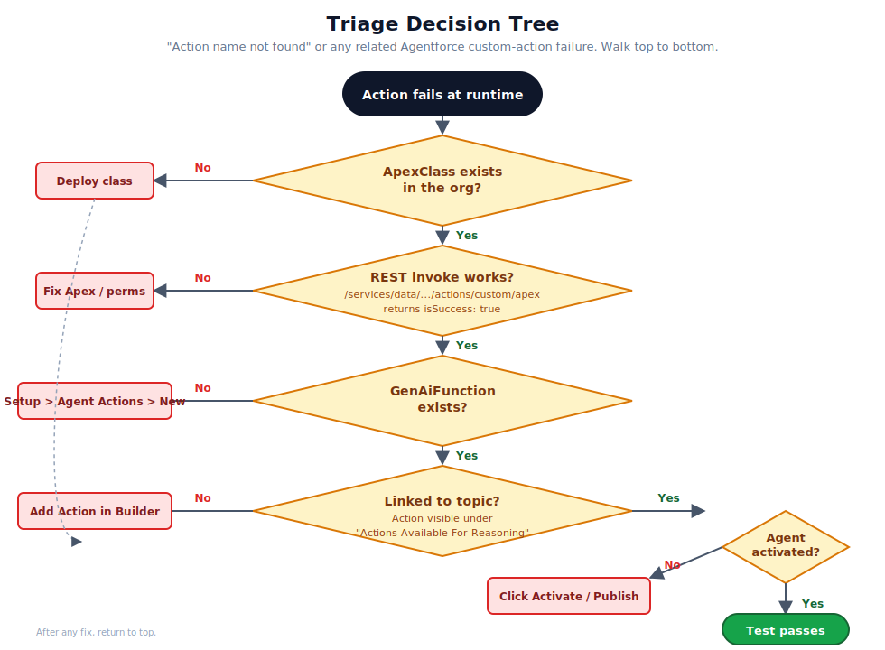

# 05. Troubleshooting

A symptom-driven map for diagnosing Agentforce failures. Find the row that matches what you are seeing, follow the suggested probes, and you should land on the layer that broke. The map is generic. Substitute your own org alias, namespace, class name, and function name throughout.

## How to use this chapter

The discipline that pays off here is to **probe each layer in cheap-to-expensive order**. Cheap probes are SOQL queries and REST calls that take a second. Expensive probes are full simulation runs, full test passes, and back-and-forth with Salesforce Support. Always exhaust the cheap probes first.



Start with the layered model from [Chapter 1](./01-mental-model.md). Each section below tells you what to query, what answer means "this layer is fine", and what to do when the answer says "this layer is the problem".

## Layer 1. Permissions for the agent user

### Check the agent user exists and is active

```bash
sf data query -o <ORG> -q "SELECT Id, Username, Profile.Name, IsActive FROM User \
    WHERE Username = '<agent.user@...>'"
```

Pass: one row, `IsActive = true`, profile is `Einstein Agent User` (or your org's equivalent).

Fail: re-create the agent user, or assign the right profile.

### Check class access on permission sets the user has

```bash
# Step 1: list permission sets
sf data query -o <ORG> -q "SELECT PermissionSet.Name, PermissionSet.Label \
    FROM PermissionSetAssignment WHERE AssigneeId = '<UserId>'"

# Step 2: confirm class access
sf data query -o <ORG> -q "SELECT Parent.Name, Parent.Label \
    FROM SetupEntityAccess \
    WHERE SetupEntityId = '<ApexClassId>' AND SetupEntityType = 'ApexClass'"
```

Pass: at least one assigned permission set lists the Apex class.

Fail: add a permission set that includes the class, or include the class in an existing one.

### Check FLS and CRUD on objects the action touches

The agent runtime evaluates field-level security as the agent user. A user who has class access but lacks FLS on a referenced field will see the action throw mid-execution.

```bash
sf data query -o <ORG> -q "SELECT Field, PermissionsRead, PermissionsEdit \
    FROM FieldPermissions \
    WHERE Parent.Profile.Id = '<ProfileId>' AND SobjectType = '<Object>'"
```

## Layer 2. The implementation

### Confirm the Apex class compiles in the org

```bash
sf data query -o <ORG> --use-tooling-api \
  -q "SELECT Name, NamespacePrefix, Status, ApiVersion, IsValid \
      FROM ApexClass WHERE Name = '<ClassName>'"
```

Pass: one row, `Status = Active`, `IsValid = true`.

Fail: redeploy. If redeploy fails, fix the source.

### Confirm the action is registered in the custom Apex actions registry

```bash
TOK=$(sf org display -o <ORG> --json | python3 -c 'import json,sys;print(json.load(sys.stdin)["result"]["accessToken"])')
INSTANCE=$(sf org display -o <ORG> --json | python3 -c 'import json,sys;print(json.load(sys.stdin)["result"]["instanceUrl"])')

curl -s -H "Authorization: Bearer $TOK" \
  "$INSTANCE/services/data/v62.0/actions/custom/apex" \
  | python3 -c "import json,sys;[print(a['name']) for a in json.load(sys.stdin)['actions']]"
```

Pass: the listing includes `<ns>__<ClassName>` (or the bare name in default-namespace orgs).

Fail: the class probably lacks `@InvocableMethod`, or the input or output wrapper is malformed. Inspect the source.

### Direct invoke

```bash
curl -s -H "Authorization: Bearer $TOK" -H "Content-Type: application/json" \
  -X POST \
  "$INSTANCE/services/data/v62.0/actions/custom/apex/<ns>__<ClassName>" \
  -d '{"inputs":[{"<inputName>": <value>}]}'
```

Pass: HTTP 200, `isSuccess: true`, output values populated.

Fail: the response will tell you what is wrong with the implementation. Permission errors, business-logic errors, or callout errors all show up here, and they show up clearly. This is the most informative test in the playbook. Run it before you blame Agentforce.

## Layer 3. The GenAiFunction wrapper

### Confirm the function record exists

```bash
sf data query -o <ORG> --use-tooling-api \
  -q "SELECT DeveloperName, MasterLabel, NamespacePrefix, \
             InvocationTargetType, InvocationTarget, \
             PluginId, PlannerId, IsLocal \
      FROM GenAiFunctionDefinition \
      WHERE DeveloperName = '<FunctionDeveloperName>'"
```

Pass: one row.

- `InvocationTargetType` is `apex` (or `flow` or `prompt` for those alternatives).
- `InvocationTarget` is the ApexClass Id (a `01p` prefix), the FlowDefinitionView Id, or the prompt template name.

Fail: the function was never created. Open *Setup, Agent Actions, New Agent Action* and create it. Make sure to retrieve the new metadata into source after.

### Confirm the schema matches the implementation

Open the JSON Schemas in `force-app/main/default/genAiFunctions/<Name>/input/schema.json` and `output/schema.json`. The required and optional properties should mirror the Apex `@InvocableVariable` declarations. The types should match (`Boolean` to `lightning__booleanType`, `String` to `lightning__textType`, etc.).

Fail mode: schema declares an input that the Apex method does not expect, or vice versa. The runtime will throw at invocation, not at deploy.

## Layer 4. Topic linkage

### Confirm the action shows up under the topic in the Builder

Open the agent in the Builder. Navigate to the topic or subagent that should be able to call the action. The action should be visible under "Actions Available For Reasoning".

Fail: the function is registered globally but the agent does not know about it. Click "Add Action" on the topic, pick the function, save.

### Confirm the `.agent` source has the linkage

```bash
grep -A4 "actions:" force-app/main/default/aiAuthoringBundles/<AgentName>/<AgentName>.agent
```

The action name should appear in the topic's `actions:` block, and the action declaration should appear in the agent's top-level `actions:` block with a `target:` URI.

Fail: source and runtime disagree. Either the local source has not been retrieved, or the agent in the org has been edited from a different machine.

## Layer 5. Activation

### Confirm the agent is activated

The new aiAuthoringBundle format does not surface activation in standard SOQL. Practical checks:

- In the Builder, look for an "Activate" or "Save and Activate" button. If you see it, the agent has not been activated yet. If the header reads "Activated" or shows a "Deactivate" option, you are good.
- Behavioural test: run the same prompt in the simulator and in test mode. If only the simulator works, activation is the most likely missing step.

Fail: click Activate. It is the single most common fix for Agentforce issues.

### Bot-version status (legacy bots only)

```bash
sf data query -o <ORG> -q "SELECT Id, DeveloperName, BotDefinitionId, Status FROM BotVersion"
```

`Status` should be `Active`. This applies to legacy `bots/`-format agents, not the new aiAuthoringBundle format.

## Common error messages and what they mean

### `Invocable action 'X' does not exist.`

- Source: `ldsAdaptersAgentAuthoring.js` validation in the Builder.
- Likely cause: the `.agent` DSL `target:` is referencing a class that does not exist in the org, or is using the wrong namespace prefix syntax.
- Fix: change the target to `apex://<ns>__<ClassName>` (with double underscores).

### `Action name not found: <ns>__<ClassName>`

- Source: agent runtime, surfaced as a `MISSING_RECORD` 500 error.
- Likely cause: one of three things, with no way to tell from the message alone.
  1. The Apex class does not exist or does not compile.
  2. There is no `GenAiFunction` wrapper for it.
  3. The agent is not activated, so the runtime registry does not yet include the linkage.
- Fix: walk through Layers 2 to 5 in order until one fails.

### `We couldn't find the flow, prompt, or apex class: apex://...`

- Source: deploy validation.
- Likely cause: the URI is using a dot separator instead of double underscores, or the class is in a namespace the deploy cannot see.
- Fix: change to `apex://<ns>__<ClassName>` form.

### `INSUFFICIENT_ACCESS_OR_READONLY` during invocation

- Source: Apex runtime.
- Likely cause: the agent user lacks class access, or lacks CRUD/FLS on a record the class touches.
- Fix: add the missing permission to the user's permission set.

### `Validation failed for action(s) ... due to invalid attribute value for 'target'`

- Source: Builder pre-flight validation.
- Likely cause: the target URI scheme is wrong (e.g. `function://` or `action://`, neither of which is valid), or the target class name is wrong.
- Fix: use one of the documented Agent Script schemes (`apex://`, `flow://`, or `prompt://`). See [Agent Script: Actions](https://developer.salesforce.com/docs/ai/agentforce/guide/ascript-ref-actions.html) and [Chapter 3](./03-naming-and-namespaces.md).

### `Something went wrong. Refresh and try again.`

- Source: agent runtime, generic.
- Likely cause: anything. This is a catch-all the platform throws when an underlying error is not safe to expose to the user.
- Fix: open the browser console for the actual error from `client.js` (look for an O11Y error log with the structured payload). The actual error is almost always informative.

## Console noise to ignore

The following are not relevant to your code. They come from internal Salesforce Lightning components:

- `AG Grid: invalid gridOptions property '...'`
- `AG Grid: enableRangeSelection is deprecated`
- `Toast: please provide at least the "label" property to show the toast`
- `dynamicCellEditor`, `dynamicCellRenderer`, `dynamicHeaderRenderer` invalid colDef warnings

Filter them out and look for `ldsAdaptersAgentAuthoring.js`, `client.js` (O11Y), and the runtime's `MISSING_RECORD` lines.

## When all of the above passes and it still does not work

If you have walked through every layer and every probe passes but the agent still fails, the remaining possibilities are:

1. **Caching.** The runtime sometimes caches resolution for several minutes. Wait, then retry.
2. **Two agents share a name.** Confirm there is only one agent with the developer name you expect, in the namespace you expect.
3. **An installed managed package is overriding your action.** Inspect the `ManageableState` of the involved metadata.
4. **A platform regression.** Search the Salesforce Trailblazer Community and check Known Issues. If nothing shows up, file a case.

Cases 1 and 2 are the most common. Cases 3 and 4 are rare but worth keeping in mind.

## References

- [REST: Get custom invocable actions](https://developer.salesforce.com/docs/atlas.en-us.api_rest.meta/api_rest/resources_actions_invocable_custom_get.htm)
- [REST: Invoke a custom Apex action](https://developer.salesforce.com/docs/atlas.en-us.api_rest.meta/api_rest/resources_actions_invocable_custom.htm)
- [Tooling API objects](https://developer.salesforce.com/docs/atlas.en-us.api_tooling.meta/api_tooling/reference_objects_list.htm)
- [Apex `SetupEntityAccess`](https://developer.salesforce.com/docs/atlas.en-us.api_tooling.meta/api_tooling/tooling_api_objects_setupentityaccess.htm)
- [Agent Script: Actions](https://developer.salesforce.com/docs/ai/agentforce/guide/ascript-ref-actions.html)
