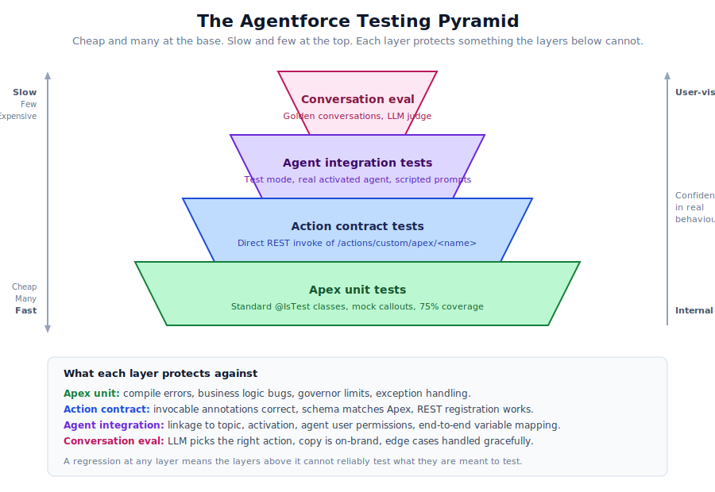

# 10. Testing

Testing an Agentforce agent is not the same as testing a normal Salesforce app. The deterministic layers (Apex, flows) test cleanly with familiar tools. The non-deterministic layer (the LLM picking actions) does not. The discipline that works is to test each layer with the right tool, and to know which kinds of bugs each layer can and cannot catch.



## The pyramid in plain English

You want lots of fast cheap tests at the base, fewer slow expensive tests at the top. Each layer covers something the layers below it cannot.

- **Apex unit tests.** Standard `@IsTest` classes. Catch business logic bugs, governor limit violations, exception handling. Fast and cheap. Should be the bulk of your test suite.
- **Action contract tests.** Direct invocation of the action via `/services/data/v62.0/actions/custom/apex/<name>`. Confirms the invocable annotations are right, the schema matches the Apex, the platform recognises the action. Fast and cheap.
- **Agent integration tests.** Use the test mode against an activated agent. Confirms the topic linkage works, the agent user has the right permissions, the variable mapping is correct. Slower, requires an org.
- **Conversation eval.** Run representative prompts through the agent. Score the responses. Catches issues with the LLM's choice of action, the wording of replies, edge cases in conversation flow. Slowest, requires either a human reviewer or an LLM judge.

## Apex unit tests

Standard practice. A few Agentforce-specific notes:

- The platform's invocable runner expects bulk shape (a list of inputs in, a list of outputs out). Your tests should pass lists, not singletons.
- Mock callouts. The agent runtime will not let you make real callouts inside a unit test (Salesforce never does), so use `Test.setMock(HttpCalloutMock.class, new YourMock())`.
- Cover the failure paths. If your action throws, write a test that exercises the throw. The runtime should see the exception, not silently swallow it.
- Run tests in CI. Block merges on coverage drops below 75 percent.

Example:

```apex
@IsTest
public with sharing class GreetUserTest {
    @IsTest
    static void greetReturnsHello() {
        GreetUser.GreetInput input = new GreetUser.GreetInput();
        input.name = 'Alex';

        Test.startTest();
        List<GreetUser.GreetOutput> outputs = GreetUser.greet(new List<GreetUser.GreetInput>{input});
        Test.stopTest();

        System.assertEquals(1, outputs.size());
        System.assertEquals('Hello, Alex!', outputs[0].greeting);
    }

    @IsTest
    static void greetThrowsOnEmptyName() {
        GreetUser.GreetInput input = new GreetUser.GreetInput();
        input.name = '';

        Test.startTest();
        try {
            GreetUser.greet(new List<GreetUser.GreetInput>{input});
            System.assert(false, 'Expected exception');
        } catch (Exception e) {
            System.assert(e.getMessage().contains('name'));
        }
        Test.stopTest();
    }
}
```

## Action contract tests

Confirms that the action is registered with the platform and that its schema matches reality. The fastest way to catch a typo in `@InvocableVariable` or a schema drift between the Apex and the GenAiFunction.

```bash
TOK=$(sf org display -o <ORG> --json | python3 -c 'import json,sys;print(json.load(sys.stdin)["result"]["accessToken"])')
INSTANCE=$(sf org display -o <ORG> --json | python3 -c 'import json,sys;print(json.load(sys.stdin)["result"]["instanceUrl"])')

curl -X POST -H "Authorization: Bearer $TOK" -H "Content-Type: application/json" \
    "$INSTANCE/services/data/v62.0/actions/custom/apex/<ns>__<ClassName>" \
    -d '{"inputs":[{"name":"Alex"}]}'
```

Expect `isSuccess: true` with the right output values. Wire this into CI as an integration test. It runs in a few seconds and catches a category of bugs that unit tests cannot.

## Agent integration tests

These exercise the live agent in test mode against scripted prompts. Because there is no first-class CLI for "run an agent test", most teams build a thin script that uses the Salesforce CLI's auth plus the Connect Agent REST API:

```bash
# Pseudo-code, the exact endpoint varies by Salesforce release
curl -X POST -H "Authorization: Bearer $TOK" \
    "$INSTANCE/services/data/v62.0/einstein/agent/<agentId>/conversation" \
    -d '{"message": "Greet me, my name is Alex"}'
```

The response includes the agent's reply and the trace of which actions fired. Assert on both.

A useful pattern: a YAML or JSON file of "golden conversations":

```yaml
- name: Basic greeting
  prompts:
    - "Hi, I'm Alex"
  expects:
    action: Greet_User
    contains: "Hello, Alex"

- name: Handles missing name
  prompts:
    - "Greet me"
  expects:
    asks_for: "name"
```

Replay these as part of your release pipeline. Failures block the release.

## Conversation eval

This is the hardest part of Agentforce testing. The LLM is non-deterministic. The same prompt may produce slightly different replies on different runs. Tests have to be tolerant of that, while still catching real regressions.

Three patterns work in practice:

### Snapshot testing with tolerance

Run a prompt through the agent. Capture the action chain (which actions fired, with what inputs). Compare to a stored snapshot. Allow the natural-language reply to vary, but require the action chain to be stable.

This catches the most important class of regressions: the LLM starts picking a different action.

### LLM-judged correctness

Ask a separate LLM (or the same one with a different prompt) to score the agent's reply against a rubric. "Does the reply correctly say hello to Alex? Yes or no." Aggregate the scores. Flag drops.

This is fuzzier but catches subtle semantic regressions.

### Adversarial probes

A small set of prompts designed to break the agent. Prompt injection attempts. Confusing wording. Edge-case names (Unicode, emoji, very long strings). The agent should handle them gracefully.

These do not run on every commit. They run nightly or before a release.

## Test data

Agentforce actions often touch live data: accounts, contacts, opportunities. Your tests need a stable data fixture that does not depend on the test environment having specific records.

Two approaches:

1. **Per-test setup.** Each test creates its own records with `@TestSetup` or inline. Slow but isolated.
2. **Shared seed data.** A scratch org definition includes a seed file that creates the same records every time. Fast, but tests can interact.

Most teams end up using a mix: per-test setup for action-level tests, shared seed for integration and conversation tests.

## What you cannot test automatically

A few things that are uncomfortable to admit but are true:

- **The LLM's quality of reasoning.** If the agent picks the right action 95 percent of the time, automated tests can confirm it. They cannot make it 99 percent.
- **The user's experience.** Whether the conversation feels right, whether it is on-brand, whether it would frustrate a real user. Human review.
- **Edge cases you have not thought of.** Production traffic will surface them. Plan for it.

This is why the pyramid does not stop at automation. It includes human review for the conversation eval layer. Treat that review as part of every release, not an optional extra.

## CI integration

A practical CI configuration for Agentforce:

```
on: pull_request
jobs:
  - apex_tests:
      run: sf project deploy validate -d force-app -o <CI_ORG>
      then: sf apex run test -o <CI_ORG> --code-coverage
  - schema_validation:
      run: validate-jsonschema force-app/main/default/genAiFunctions/**/*.json
  - action_contract:
      run: scripts/test-action-contracts.sh
```

```
on: push to main
jobs:
  - deploy_to_integration:
      run: sf project deploy start -d force-app -o <INTEGRATION_ORG>
  - integration_tests:
      run: scripts/run-agent-integration-tests.sh
  - notify:
      run: scripts/post-status-to-slack.sh
```

The conversation eval typically does not run on every commit. It is too slow and too LLM-call-heavy. Run it nightly or as a manual step before a release.

## Quick reference

| Layer | What to use | Speed | What it catches |
|-------|-------------|-------|-----------------|
| Apex unit | `@IsTest` | Seconds | Logic bugs, governor limits, exceptions |
| Action contract | `curl` to `/actions/custom/apex/...` | Seconds | Schema drift, invocable annotation errors |
| Agent integration | Scripted test mode against active agent | Minutes | Linkage, perms, variable mapping |
| Conversation eval | Golden conversations + LLM judge | Tens of minutes | LLM reasoning regressions, edge cases |

If you do all four, your agent will surprise production users far less often.

## References

- [Apex testing best practices](https://developer.salesforce.com/docs/atlas.en-us.apexcode.meta/apexcode/apex_qs_test.htm)
- [`HttpCalloutMock` interface](https://developer.salesforce.com/docs/atlas.en-us.apexcode.meta/apexcode/apex_classes_restful_http_testing_httpcalloutmock.htm)
- [REST: Invoke a custom Apex action](https://developer.salesforce.com/docs/atlas.en-us.api_rest.meta/api_rest/resources_actions_invocable_custom.htm)
- [Salesforce CLI: `sf apex run test`](https://developer.salesforce.com/docs/atlas.en-us.sfdx_cli_reference.meta/sfdx_cli_reference/cli_reference_apex_commands_unified.htm)
- [Agentforce: Invoke from Apex and Flow](https://developer.salesforce.com/blogs/2025/04/invoke-agentforce-agents-with-apex-and-flow)
