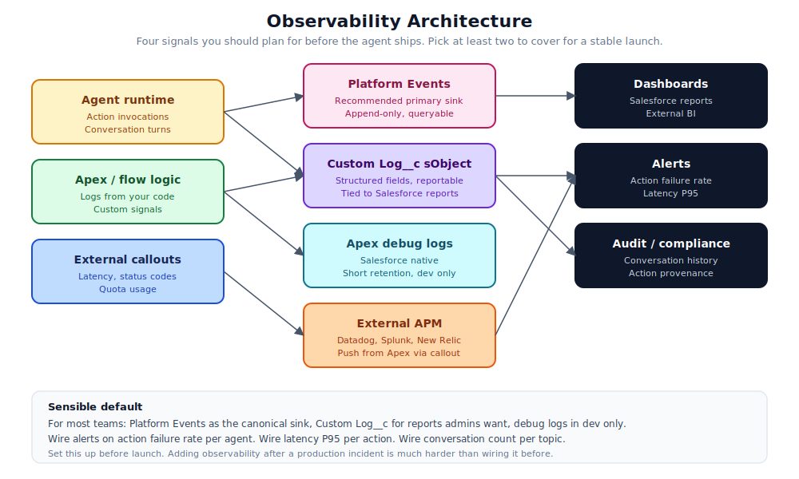

# 11. Observability

You cannot maintain an agent you cannot see into. The hardest production issues are not the ones that throw a clear exception. They are the ones where the agent quietly drifts off behaviour and nobody notices for a week. Observability is the discipline that catches drift early.



## What you actually need

Four signals will cover most teams. If you only have time for two, pick the first two.

1. **Action invocation log.** Every time an action runs, record what was called, with what inputs, by which agent user, and what came back. This is your audit trail and your debugging tool.
2. **Failure rate per action.** Percentage of action invocations that fail, broken down by action and by error type. Spikes mean something changed.
3. **Latency per action, P95 and P99.** Slow actions kill the conversation. The user types a question, waits ten seconds, and walks away.
4. **Conversation outcomes.** Did the conversation end with the user satisfied, escalated to a human, or abandoned? Surfaces drift in the LLM's reasoning that is invisible to action-level metrics.

## Where to put the signals

Salesforce gives you several sinks. Pick based on your team's tooling.

### Platform Events (recommended primary sink)

Append-only, queryable, integrates with both Salesforce reports and external pub/sub consumers. Emit a Platform Event from inside every Apex action:

```apex
public static List<GreetOutput> greet(List<GreetInput> inputs) {
    Long startMillis = System.currentTimeMillis();
    List<GreetOutput> outputs = new List<GreetOutput>();
    Boolean success = false;
    try {
        for (GreetInput input : inputs) {
            GreetOutput output = new GreetOutput();
            output.greeting = 'Hello, ' + input.name + '!';
            outputs.add(output);
        }
        success = true;
    } finally {
        Agent_Action_Invocation__e ev = new Agent_Action_Invocation__e(
            Action_Name__c = 'Greet_User',
            Success__c = success,
            Latency_Ms__c = System.currentTimeMillis() - startMillis,
            Inputs_Json__c = JSON.serialize(inputs)
        );
        EventBus.publish(ev);
    }
    return outputs;
}
```

Define the Platform Event once. Reuse from every action. Subscribers (reports, dashboards, external sinks) consume the same shape.

### Custom log object (Log__c)

A regular sObject with the same fields as the Platform Event, plus whatever sticky context you need (user, conversation id, agent name). Records persist in storage rather than streaming, so you can query historical data with SOQL and build reports.

Trade-off versus Platform Events: durable but uses up storage.

### Apex debug logs

Salesforce's native logging. Useful for debugging individual issues but not for production observability. Short retention, dev-only by default.

Useful in dev and QA. Do not rely on it for production.

### External APM

Push critical signals out to Datadog, Splunk, New Relic, or whichever tool your ops team already uses. Adds observability latency (callouts) but gives you a unified view across systems.

Common pattern: emit Platform Events for everything, subscribe with a Mulesoft or Heroku consumer that forwards to your APM.

## Dashboards worth building

Three dashboards that earn their keep:

### Operations dashboard

For the team running the agent day-to-day.

- Conversation count, last hour, last day, last week.
- Action invocations by action, top 10 by volume.
- Action failure rate, with a threshold alert.
- P95 latency per action.

### Quality dashboard

For the conversation designers and product owners.

- Conversations that ended in escalation.
- Conversations the user abandoned mid-flow.
- Most-used topics versus least-used.
- Confirmation rate (agent asked for confirmation, user said yes versus no).

### Cost dashboard

For finance and engineering leadership.

- Token usage by agent, by topic.
- Estimated dollar cost per conversation.
- Trend over time, monthly.
- Outliers (single conversations consuming far more than average).

These do not have to be in Salesforce. Many teams build them in their existing BI tool from Platform Event data.

## Alerts

Alerts have to be actionable. An alert that fires at 3am with no clear next step trains the team to ignore alerts.

Worth setting up:

- **Action failure rate above 5 percent for 10 minutes.** Page on-call.
- **Action latency P95 above 8 seconds for 10 minutes.** Page on-call.
- **No action invocations in the last 30 minutes during business hours.** Probably means the agent is broken upstream. Page on-call.
- **Activation event in production.** Notify the team channel. Not a page, but everyone should know.

Not worth setting up (yet):

- "LLM gave a weird answer once". Too noisy.
- "Conversation ended without resolution". Too common, not actionable.
- "Token usage 5 percent above normal". Wait for a meaningful threshold.

## Conversation provenance

For agents that take consequential actions (refunds, contract sends, record updates), keep a clear thread from "what the user said" to "what the agent did" to "what changed in the data".

Practical pattern: include a `conversation_id` and `turn_id` on every record the agent touches. Custom fields on the affected sObject. When something goes wrong, you can answer "which conversation caused this?" with a query.

This sounds heavyweight. It is. It is also the difference between a five-minute investigation and a four-hour one when something goes sideways.

## What you should be able to answer at any time

If your observability is right, you should be able to answer all of these in five minutes or less:

- How many conversations did the agent have today?
- Which actions ran most? Least?
- What is the failure rate per action? Has it changed in the last week?
- How fast is the agent? Is it getting slower?
- If a user complained about a specific conversation, can you find it and replay the action chain?
- If a record changed mysteriously, can you trace it back to a conversation?
- What did this cost last month, and what is it on track to cost this month?

If you cannot answer one of these, that is the next thing to wire up.

## Common observability mistakes

- **Logging too much.** Every action emits a Platform Event with every input. Storage fills up, costs blow out, no one looks at the data.
- **Logging too little.** "We log errors". When something is wrong, you have no idea what happened before the error.
- **Logging unreliably.** A try/catch around the log emit, swallowing failures. When the logger breaks, you do not know.
- **Missing correlation.** Logs from the agent runtime, the action, and the database have no common identifier. You cannot piece together a conversation.
- **No retention policy.** Logs accumulate forever. Storage cost grows linearly. Eventually someone has to clean up under pressure.
- **Logs that include secrets.** Bearer tokens, customer PII, payment data, all sitting in your log object. Fix this before it becomes a compliance incident.

## Wire it up before launch

The strongest piece of advice in this chapter: set this up before the agent goes to production. Adding observability after the fact is genuinely painful. You have to instrument working code, retrofit Platform Events, build dashboards on data that did not exist last month, train the team on what to watch.

Set it up early, even before the agent does anything interesting. The first dashboard you build will be empty. That is fine. Better an empty dashboard you can fill up than no dashboard when you actually need one.

## References

- [Platform Events Developer Guide](https://developer.salesforce.com/docs/atlas.en-us.platform_events.meta/platform_events/)
- [Apex debug logs](https://help.salesforce.com/s/articleView?id=sf.code_debug_log.htm)
- [Big Object overview (long-term log storage)](https://developer.salesforce.com/docs/atlas.en-us.bigobjects.meta/bigobjects/big_object.htm)
- [Salesforce reports](https://help.salesforce.com/s/articleView?id=sf.reports_overview.htm)
- [Connect REST API for Agentforce](https://developer.salesforce.com/docs/atlas.en-us.chatterapi.meta/chatterapi/)
