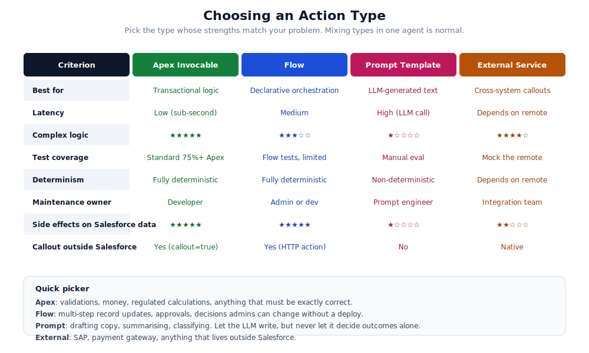

# 12. Decision Matrix

Most Agentforce questions reduce to "which type of action should this be?". The wrong choice means rebuilding later, or living with a poor fit forever. This chapter is a one-page reference for picking the right type the first time.

## The choice

Five common ways to back an agent action:

- **Apex `@InvocableMethod`.** Custom Apex code. Most flexible.
- **Auto-launched flow.** Declarative orchestration. Admin-friendly.
- **Prompt template.** LLM-generated text. Non-deterministic by design.
- **External Service or Named Credential callout.** Calls into another system.
- **Standard Invocable Action.** Salesforce-shipped actions like `queryRecords`.

Most agents end up with a mix. Picking each one for the right reason is the trick.

## Picker by use case

### "I need to run business logic that has to be exactly correct."

Apex. Period. Validations, calculations, anything that touches money, anything regulated. The LLM cannot be trusted with this. Apex is deterministic and testable.

### "I want admins to be able to change this without a deployment."

Flow. Multi-step record updates, approval routing, decision branches. Admins can iterate without involving developers. The trade-off is less flexibility for genuinely complex logic.

### "I want the LLM to generate text in a controlled way."

Prompt template. Drafting emails, summarising records, classifying text. The output is non-deterministic but you control the structure of what the model is asked to produce.

### "I need to call out to a system Salesforce does not own."

External Service for declarative use, or a Named Credential plus an Apex method for programmatic control. External Service is faster to set up. Named Credential gives you full control over the request and response handling.

### "Salesforce already has an action for this."

Use the standard one. `queryRecords`, `identifyObject`, `getRecordSummarizationPrompt`, etc. Salesforce maintains them. They will get faster and more capable over time. Do not rebuild what they ship.

## Picker by criterion

### Latency

| Type | Typical latency |
|------|----------------|
| Apex (no callout) | Sub-second |
| Flow (no callout) | Sub-second to a couple of seconds |
| Prompt template | Several seconds (LLM call) |
| External callout | Depends on the remote system |
| Standard action | Sub-second to a couple of seconds |

If conversation responsiveness matters, prefer the faster types and push slow work into queueables.

### Determinism

If the same input must always produce the same output, use Apex or Flow. Prompt templates are non-deterministic. External services depend on the remote.

### Test coverage

Apex tests are first-class. Flow tests exist but are limited. Prompt templates require manual evaluation or LLM-judged eval. External services need mock contracts.

### Maintenance ownership

| Type | Who tends to own it |
|------|---------------------|
| Apex | Developer |
| Flow | Admin or developer |
| Prompt template | Prompt engineer or content designer |
| External callout | Integration engineer |
| Standard action | Salesforce |

Pick the type that fits the skills of the person who will keep it working long-term.

### Side effects on Salesforce data

Apex and Flow can write any data the agent user can access. Prompt templates do not write data directly. External callouts depend on what the remote does. Standard actions are limited to what Salesforce ships.

If the action has to update records, use Apex or Flow.

## Common mismatches

Patterns we see in struggling projects:

### Prompt template doing business logic

Someone wanted to "have the LLM decide if a refund is allowed". The LLM is creative, the prompt is wordy, and the answer changes from run to run. The right answer is an Apex method that evaluates the rules deterministically. The prompt template can phrase the result, but should not decide the result.

### Apex action doing what a flow could

The opposite trap. A simple "update Status to Closed when Outcome is Resolved" does not need Apex. A flow does it, an admin can change it, and you do not have to write a test class.

### Standard action that is "almost right"

Salesforce's `queryRecords` does not quite do what we want, so we wrote a custom Apex version. Now we maintain a parallel implementation that diverges from Salesforce's over time. Prefer composing standard actions, even if you have to call two of them, over rebuilding.

### Callout from an action's hot path

The action calls an external system synchronously. The agent's time budget is gone before the user gets a reply. The right pattern is to kick off the callout in a queueable and have the action return a "started" status. Then a follow-up action (or a Platform Event) tells the agent the result is ready.

### Flow doing what a callout would

A flow that does ten record updates that should really be one external API call. Slow, hard to debug, hits governor limits. If the work is genuinely external, do it with a callout.

## A useful sequence for picking

1. Is there a standard action that fits? Use it.
2. Can a flow do this? An admin can maintain it, no Apex needed.
3. Does it need exact determinism or governor-limit-aware optimisation? Apex.
4. Does it need text generation? Prompt template, with deterministic logic around it.
5. Does it call out? External Service or Apex with Named Credential.

In that order. Stop at the first yes.

## Composition is normal

Real agents almost always combine types. A typical flow:

- Apex action that authorises the user and pulls the relevant records.
- Standard action that queries related records.
- Apex action that runs the business rule and decides what to do.
- Prompt template that drafts the user-facing response.
- Apex action that updates the records.
- Custom Log__c entry, emitted via Platform Event.

Six actions, five different types, one cohesive feature. The agent's reasoning loop strings them together.

## When you are not sure

Build it as Apex first. Apex is the most flexible. Once you have it working, see whether it could be simpler as a flow, or whether the LLM should be doing some of the work via a prompt template. Refactor down rather than up. Cheaper than the other direction.

## References

- [Agent Script: Actions](https://developer.salesforce.com/docs/ai/agentforce/guide/ascript-ref-actions.html)
- [Apex `@InvocableMethod`](https://developer.salesforce.com/docs/atlas.en-us.apexcode.meta/apexcode/apex_classes_annotation_InvocableMethod.htm)
- [Flows](https://help.salesforce.com/s/articleView?id=sf.flow.htm)
- [Prompt templates (`GenAiPromptTemplate`)](https://developer.salesforce.com/docs/atlas.en-us.api_meta.meta/api_meta/meta_genaiprompttemplate.htm)
- [External Services](https://help.salesforce.com/s/articleView?id=sf.external_services.htm)
- [Standard Invocable Actions](https://developer.salesforce.com/docs/atlas.en-us.api_action.meta/api_action/actions.htm)
