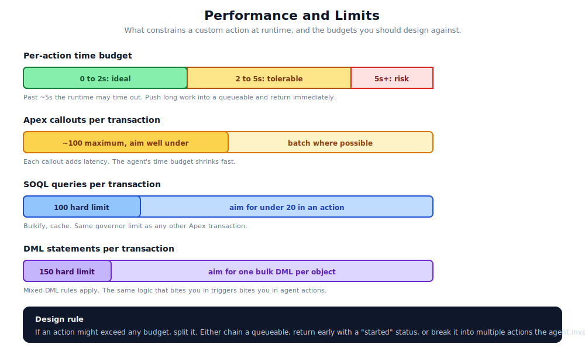

# 13. Performance and Limits

Agentforce actions run inside the Salesforce platform, which means they are bounded by the same governor limits as any other Apex transaction. They are also bounded by the agent runtime's per-step time budget, which is stricter than what most platform code has to live within. This chapter covers the budgets and the patterns that fit inside them.



## The four budgets that matter most

### 1. Per-action time budget

The agent runtime gives each action a few seconds to return. Past that, the runtime times out and the conversation either retries or gracefully fails.

Practical guidance:

- **Under 2 seconds**: ideal. The conversation feels responsive.
- **2 to 5 seconds**: tolerable. The user notices.
- **Over 5 seconds**: risk. The runtime may time out, or the user may walk away.
- **Over 10 seconds**: do not do this. Move the work asynchronously.

For long work, use a queueable Apex job. The action kicks off the queueable and returns immediately with a status like "Started, you'll be notified". A separate action or Platform Event tells the agent when the result is ready.

### 2. Apex callouts per transaction

Salesforce caps callouts at around 100 per transaction (the exact number is in the Salesforce limits documentation). Each callout adds latency. A typical action should make zero or one callout. Two is uncomfortable. More is a smell.

Patterns that help:

- Bulk callouts where the remote API supports them.
- Cache callout responses if they are deterministic and not time-sensitive.
- Move multi-callout work into a queueable that the agent waits on.

### 3. SOQL queries per transaction

Standard limit: 100 queries per transaction. Hard cap. The agent runtime adds no new constraint here, but the per-action time budget tightens it. A single action should aim for fewer than 20 queries.

Patterns that help:

- Bulk queries with `IN` clauses instead of per-record queries.
- Selective queries with indexed fields.
- Prefer joining in SOQL to multiple sequential queries.

### 4. DML statements per transaction

Standard limit: 150. Mixed-DML rules apply. A single action that updates records should batch them: one DML per object, not one DML per record.

The mixed-DML rule (cannot mix setup and non-setup objects in the same transaction) bites Agentforce actions sometimes. If you change a User record and an Account in the same action, you will hit it.

## Less obvious limits

### Heap size

Six MB (synchronous) or twelve MB (async). Mostly relevant for actions that build large response payloads. If the action returns a list of records with rich content, watch the heap.

### CPU time

Ten seconds synchronous, sixty seconds async. The agent runtime is synchronous from the perspective of the transaction, so you have ten seconds of CPU. Plenty for normal logic. Tight if you are parsing large JSON or doing heavy string manipulation.

### Aggregate queries

Up to 300 aggregate queries per transaction. Rarely a problem in agent actions, but worth knowing if you are building reporting-heavy logic.

### Future calls

Fifty per transaction, but agent actions do not run in `@future` context. They run synchronously. If you need future-style behaviour, queue it.

### Email limits

If the action sends email: ten emails per transaction (single recipient), 5000 single emails per day per org. Easy to blow if the agent has a "send email" action that runs on every conversation.

## Patterns for staying inside the budgets

### Push slow work asynchronously

The most useful pattern. The action does the minimum synchronous work, kicks off a queueable, returns. The queueable does the slow work and either updates a record (which the agent can poll) or emits a Platform Event (which the agent can subscribe to).

```apex
@InvocableMethod(label='Generate Report' callout=false)
public static List<Result> generate(List<Input> inputs) {
    List<Result> results = new List<Result>();
    for (Input input : inputs) {
        Id jobId = System.enqueueJob(new ReportGenerator(input.recordId));
        Result result = new Result();
        result.status = 'Started';
        result.jobId = jobId;
        results.add(result);
    }
    return results;
}
```

The agent gets back "Started" with a job id. A follow-up action ("Check Report Status") returns the result when ready.

### Cache deterministic results

If the action returns the same output for the same input, cache it. Custom storage, Platform Cache, or even a custom object with a TTL field. Cache hit means no LLM call, no callout, no SOQL.

Cache invalidation is hard. Default to short TTLs (minutes, not hours) unless you have a clear refresh strategy.

### Bulk where possible

The invocable runner already gives you a list of inputs. Use it. Process the list as a unit. One bulk SOQL, one bulk DML, one bulk callout if your remote supports it. Resist the urge to write a `for` loop that processes each input one at a time.

### Prefer composition over a single mega-action

A single 800-line action that does everything is hard to test, hard to optimise, and likely to hit limits. Two or three composable actions that each do one thing are easier all round.

The agent's planner is happy to invoke them in sequence. That is what it is for.

### Watch out for trigger amplification

Your action updates a record. A trigger fires. The trigger calls a flow. The flow updates another record. Another trigger fires. Suddenly your two-line action has consumed sixty SOQL queries.

This is not unique to Agentforce. It is just easier to forget about when the action looks small.

## Measuring before you optimise

Standard advice that applies here: do not optimise without measuring. Salesforce's debug logs include limit consumption. The Platform Event log pattern from [Chapter 11](./11-observability.md) can include latency. Set baselines before assuming you have a problem.

Specifically:

- Measure P95 latency per action over a representative period.
- Measure the median number of SOQL queries per invocation.
- Measure the median number of callouts per invocation.

If you have these numbers, you know where to spend optimisation effort. If you do not, you will guess wrong.

## When the limits are wrong for your use case

Sometimes the work genuinely cannot fit in a single action's budget. Options:

1. **Split the work across multiple actions.** The agent invokes them in sequence.
2. **Move to async.** Queueable, batch Apex, Platform Events.
3. **Pre-compute.** Run a scheduled job that prepares the data; the action just reads it.
4. **Use Salesforce Functions or external compute.** For genuinely heavyweight processing.

In that order. Splitting is cheapest, external compute is most expensive.

## A worked sizing exercise

Suppose you are building an action that "summarises a customer's recent activity":

- Pull the contact (1 SOQL).
- Pull related cases (1 SOQL).
- Pull related opportunities (1 SOQL).
- Pull related tasks (1 SOQL).
- Compose a JSON response (no DML).

Five queries, no DML, no callouts. Sub-second latency. Comfortable.

Now add: "and email the customer a summary". You added an external callout (or `Messaging.sendEmail`) and email-limit consumption. Still fine, but you now hit the email-per-day cap if the agent is high-volume.

Now add: "and update the contact's last_summary_at field". One DML. Still fine, but if the action is invoked 10000 times per day, that is 10000 DML statements that contribute to your daily limits.

This is the kind of calculation that goes wrong if you do not do it on the back of a napkin before you build. Doing it ahead of time is cheap. Discovering it under production load is not.

## References

- [Execution Governors and Limits](https://developer.salesforce.com/docs/atlas.en-us.apexcode.meta/apexcode/apex_gov_limits.htm)
- [Salesforce Developer Limits and Allocations Quick Reference](https://developer.salesforce.com/docs/atlas.en-us.salesforce_app_limits_cheatsheet.meta/salesforce_app_limits_cheatsheet/salesforce_app_limits_platform_apexgov.htm)
- [Queueable Apex](https://developer.salesforce.com/docs/atlas.en-us.apexcode.meta/apexcode/apex_queueing_jobs.htm)
- [Platform Cache](https://developer.salesforce.com/docs/atlas.en-us.apexcode.meta/apexcode/apex_cache_namespace_overview.htm)
- [Mixed-DML errors](https://developer.salesforce.com/docs/atlas.en-us.apexcode.meta/apexcode/apex_dml_setupobjects.htm)
