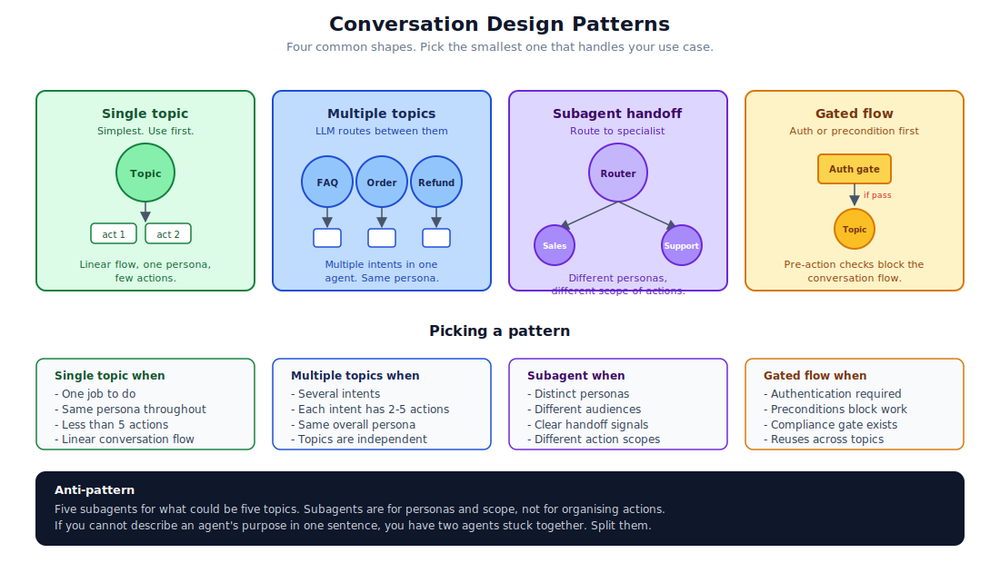

# 14. Conversation Design

The hardest part of building a good agent is not the code. It is deciding what the conversation should feel like and what the agent should be allowed to do. This chapter is the small set of patterns that handle most cases, plus the traps that look reasonable and are not.



## The four patterns that cover most agents

### Single topic

Simplest case. One job, one persona, a handful of actions, linear flow. Most teams should start here. You can always grow into the bigger patterns later.

When it fits:

- The agent does one well-defined thing.
- No more than five or six actions.
- The conversation is short and predictable.

Build a single topic with the actions linked. Don't reach for subagents.

### Multiple topics

Several intents that share a persona. The user might ask about ordering, refunds, or shipping, and the agent handles all three with the same voice.

When it fits:

- The agent has multiple jobs but the same audience and personality.
- Each job has two to five actions.
- The topics are independent (handling a refund does not require handling an order first).

Define a topic per intent. Let the LLM router pick. Keep variables global so context can flow across topics if the user changes their mind mid-conversation.

### Subagent handoff

A router agent that decides which specialist subagent should handle the conversation. Each subagent has its own instructions, audience, and scope of actions.

When it fits:

- Distinct personas (sales versus support feel different).
- Different audiences (an internal user gets different content than a customer).
- Genuinely different scopes (the support agent should not have the sales agent's discount actions).

Build the router as a small agent that mostly does intent classification. Build each subagent as if it were the only agent in the system.

### Gated flow

A precondition or authentication step blocks the conversation until satisfied. Common when the agent acts on user-specific data and you cannot trust the LLM to enforce who is who.

When it fits:

- Authentication is required before any action runs.
- A compliance gate exists (legal disclaimer, age confirmation, terms acceptance).
- A status check (the user has to be a paying customer for the action to apply).

Build the gate as the entry topic. Set a variable when the gate passes. Other topics check the variable before they invoke their actions.

## Pattern selection traps

### Five subagents for what could be five topics

The most common mistake. Subagents are heavyweight. They have their own instructions, their own action scope, their own persona. Five of them is five times the maintenance.

If your subagents share a persona and audience, they are topics. Combine them.

A useful test: imagine someone reading the conversation. Would they say "this is the same agent helping with different things" or "this is two different agents"? If the former, use topics.

### One topic that grew to 30 actions

Topics get crowded over time. Every new feature adds an action, and the LLM has to consider all of them on every turn. Eventually it picks wrong, or the token cost balloons.

A useful threshold: if a topic has more than ten actions, look for opportunities to split. Group by intent ("manage orders" versus "track shipments") and let the LLM router pick.

### Variables for things that should be records

Tempting: thread the user's account number through the conversation as a variable. Resist when the underlying data lives in Salesforce. The platform already has a record. Reference it by Id, not by every field copied into a variable.

Variables are for conversation state. Database state belongs in the database.

### A "smart" agent that improvises

The temptation: write open-ended instructions and let the LLM figure it out. "You are a helpful agent. Help the user with whatever they ask."

This works in demos. It does not work in production. The agent picks actions inconsistently, the conversation drifts off-script, and edge cases produce strange results.

A constrained agent with clear topics and explicit action scoping is usually better than a "smart" one. The LLM is good at choosing between known options. It is not good at inventing options that are not in front of it.

## Variables and state

A few patterns for managing conversation state cleanly:

### Linked variables for platform context

Variables sourced from the conversation runtime: the messaging session id, the contact id, the user's language. Declare them with `linked` in the `.agent` DSL. They populate automatically.

```yaml
variables:
    EndUserId: linked string
        source: @MessagingSession.MessagingEndUserId
        description: "The end user's id in the messaging session"
```

### Mutable variables for conversation state

Variables the agent updates during the conversation: whether the user is authenticated, what step they are on, the last error.

```yaml
variables:
    isAuthenticated: mutable boolean = false
        description: "Whether the user has been authenticated"
```

Set defaults to safe values. Update via action outputs.

### Don't use variables for secrets

If a variable might contain something the LLM should not see (a token, an internal id, anything you would not show to the user), filter it from the agent context with `filter_from_agent: True`. The variable can still be used by Apex, but the LLM does not see it.

## Topic instructions that work

Topic instructions are what the LLM uses to decide when to enter a topic and what to do once it is in there. A few rules of thumb:

### Be concrete

"Help the user with their order" is too vague. "Help the user check the status of an existing order or place a new order. Use the order_id from the user's input if provided." is workable.

### List the actions and when to use each

"To check status, run @actions.Get_Order_Status. To place a new order, run @actions.Create_Order." The LLM is much better at picking from a labelled list than at inventing the right action.

### Specify error behaviour

"If the user does not provide an order_id, ask for one. If the action fails, apologise and offer to escalate." Explicit error handling beats hopeful improvisation.

### Constrain the format

"Reply in plain text under 100 words. Do not use markdown. Do not use emoji." If you need a specific format, say so. The LLM will default to whatever is in its training, which is rarely what you want.

## Action descriptions that work

Action descriptions are also part of the LLM's context. They affect when the LLM picks an action.

A good description:

- Describes what the action does, in one sentence.
- Names the inputs and what they mean.
- Mentions any side effects worth knowing.
- Is under 200 characters.

A bad description:

- Sells the action ("This amazing action lets users check their orders!")
- Repeats the action name.
- Includes HTML or markdown.
- Goes on for several lines.

The LLM reads these on every turn. Bloated descriptions cost tokens and confuse the model.

## Confirmations and irreversibility

For destructive or sensitive actions, set `isConfirmationRequired: true` on the GenAiFunction. The runtime surfaces a confirmation step in the conversation:

> Agent: I'm about to send the welcome email to alex@example.com. Should I proceed?
> User: Yes.
> Agent: Email sent.

This is a small UX cost for a large reduction in misfires. Use it for:

- Sending email or SMS.
- Charging payments.
- Deleting records.
- Cancelling orders.
- Anything that is hard to undo.

Do not use it for:

- Read-only actions. The confirmation feels weird.
- Actions the agent runs many times in sequence ("for each item, do X"). The user will hate it.

## Escalation paths

Every agent should have a way for the conversation to escape to a human when things go wrong. Either a dedicated subagent for "escalation", or a topic the LLM can route to when it gets stuck.

Triggers for escalation:

- The user asks for a human directly.
- The agent has tried the same action three times and failed.
- The conversation gets long without resolution (token budget warning).
- The user is angry (sentiment detection).
- The action returns a "this requires human review" status.

Build the path before launch. Adding it under pressure when production users start complaining is harder.

## A useful design template

For each new agent, write a one-page design doc covering:

1. What is the agent for? In one sentence.
2. Who is the audience? Internal user, customer, partner?
3. What persona? Tone, voice, formality.
4. What topics will the agent handle?
5. What actions are in scope? Out of scope?
6. What variables are linked from the platform? What variables does the conversation maintain?
7. What is the escalation path?
8. What is the failure mode? How does the agent gracefully degrade?

This takes an hour. It saves weeks of "the agent does this weird thing".

## References

- [Agent Script: Reference](https://developer.salesforce.com/docs/ai/agentforce/guide/ascript-reference.html)
- [Agent Script: Language Characteristics](https://developer.salesforce.com/docs/ai/agentforce/guide/ascript-lang.html)
- [Agent Script: Actions](https://developer.salesforce.com/docs/ai/agentforce/guide/ascript-ref-actions.html)
- [Agentforce Builder UI (Trailhead)](https://trailhead.salesforce.com/content/learn/modules/new-agentforce-builder-quick-look/explore-the-new-agentforce-builder)
- [`isConfirmationRequired` on GenAiFunction](https://developer.salesforce.com/docs/atlas.en-us.api_meta.meta/api_meta/meta_genaifunction.htm)
