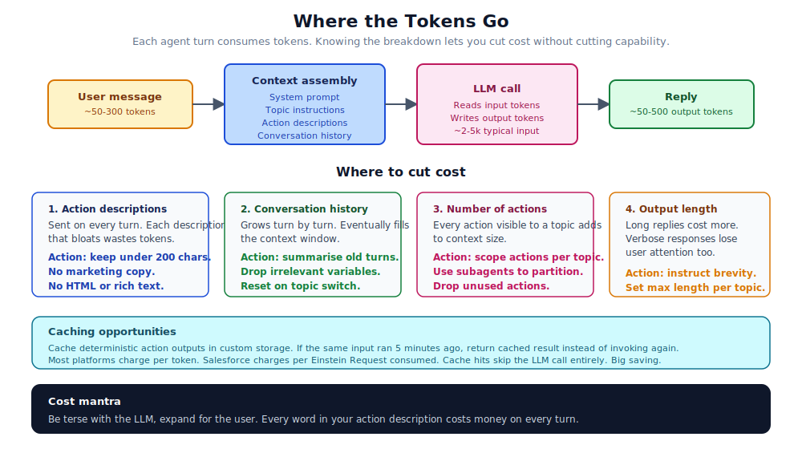

# 17. Cost Optimization

Agentforce is metered. Every conversation turn consumes Einstein Requests, which translate to a real bill at the end of the month. Most teams pay more than they need to because the cost model is invisible while you are building. This chapter is the small set of habits that keep cost under control without sacrificing capability.

## What you are paying for

Each agent turn consumes tokens for:

- The system prompt (usually invariant, set once at agent level).
- The topic's instructions (relevant topic only).
- The action descriptions for actions visible in the topic.
- The conversation history (grows turn by turn).
- The user's current message.
- The LLM's reply.

Of those, the ones you have direct control over are: action descriptions, conversation history, and the number of actions linked to a topic. Optimise those first.

## The four levers

### 1. Action descriptions

Every action linked to a topic puts its description in the LLM's context on every turn. Bloated descriptions waste tokens repeatedly.

A useful target: under 200 characters per description. Under 80 is even better.

A bad description (270 chars):

> "This wonderful action allows the agent to perform an extensive lookup operation against the customer record database in order to retrieve detailed information regarding the customer's connection status to the Lumin authentication system."

A good description (90 chars):

> "Returns whether the user has an active Lumin session, plus a status message."

The LLM does not care about marketing copy. It cares about what the action does. Be terse.

### 2. Conversation history

The runtime sends previous turns as context. After ten turns, this can dominate the cost of a conversation.

What helps:

- Reset history when the conversation transitions between topics, if the topics are independent.
- Summarise old turns into a short digest. Some agents include a "summary so far" variable that the LLM updates.
- Drop variables that are no longer relevant. They take up context room.

There is a tradeoff. Less history means the LLM can lose track of what the user wants. Find the right balance for your conversation pattern.

### 3. Number of actions per topic

Every action linked to a topic is in scope for the LLM on every turn of that topic. Twenty actions in a topic means twenty descriptions in the context, every turn.

What helps:

- Group actions into topics by intent. The LLM router picks the topic; only that topic's actions are in scope.
- Use subagents for genuinely different scopes (sales versus support).
- Drop unused actions. Audit topics quarterly.

A reasonable target: under ten actions per topic. Past that, look for splits.

### 4. Output length

Long replies cost more. They also lose user attention.

What helps:

- Topic instructions like "Reply in plain text under 100 words. No markdown, no emoji."
- A `progress_indicator_message` on the action that says something useful while the action runs, so the reply itself can be short.
- Resist the LLM's natural verbosity. It will always want to explain itself.

## Caching

Caching is the most powerful cost optimisation you can apply, and most teams do not bother.

The pattern: if the same input has been processed within the last N minutes, return the cached result instead of invoking the action. Especially valuable for read-only actions that hit the same record repeatedly.

Implementation choices:

- **Platform Cache.** Salesforce-native. Org-wide or session-scoped. Handles eviction.
- **Custom object with a TTL field.** Slower but durable. Works without a Platform Cache license.
- **External cache (Redis, Memcached).** If you already have one, add the agent to it.

Cache invalidation is the hard part. Default to short TTLs (one to five minutes) unless you have a clear refresh strategy. The cost of a stale cache hit is usually small; the cost of a wrong answer is usually larger.

## Patterns that save real money

### Smaller models for simpler tasks

If your platform supports model selection, route simple tasks to cheaper models. Classification, formatting, and short replies do not need the most capable model. Reserve the top-tier model for complex reasoning.

Salesforce's roadmap is moving towards more model choice. Check what is available in your release.

### Pre-compute deterministic outputs

If the action's output for a record can be computed in advance and stored on the record itself, do it once on update via a trigger. The agent then reads the field instead of computing the answer on every conversation turn.

Trade-off: extra storage, slight staleness. Almost always worth it for high-volume agents.

### Truncate inputs

Apex actions sometimes accept long string inputs that the agent could send unbounded. If your action only needs the first 200 characters, truncate at the action boundary. The LLM does not pay for truncation, but downstream callouts and storage do.

### Don't be polite to the LLM

Action descriptions, topic instructions, system prompt: these are read by a model, not a person. Avoid greetings, apologies, hedging, marketing language. The model does not need them. They cost tokens.

### Avoid unnecessary subagents

Each subagent has its own instructions and action surface that ride along with the conversation. Five subagents that could be five topics in one agent multiply the context overhead.

## Measuring cost

You cannot optimise what you cannot see. A few measurements worth tracking:

- Average tokens per conversation, by agent.
- Tokens per action invocation, by action.
- Conversations per day, total and by topic.
- Cache hit rate, if you have caching.
- Estimated dollar cost per conversation, monthly trend.

Most of this is available in Agentforce's own analytics or via Platform Events emitted from your action code. Build a dashboard. Look at it monthly.

## When cost is the right priority

Not every agent is cost-sensitive. A high-value internal agent that saves hours of manual work is worth a few dollars per conversation. A high-volume customer-facing agent at scale needs every penny squeezed out.

Make the cost-versus-capability tradeoff explicitly. Don't sacrifice capability for cost on an agent where capability is the whole point.

## Cost smells in production

Things to investigate:

- **Cost per conversation creeping up over time.** Probably history bloat or growing topic action lists. Audit.
- **Outlier conversations consuming many times the average.** Probably long sessions or repeated retries. Investigate.
- **Cost spikes coinciding with deployments.** Probably a new action with a verbose description. Diff and review.
- **Cost rising with no traffic increase.** Probably the model the platform is using has changed, or the LLM is being asked to do more per turn. Check release notes.

## A reasonable monthly review

Once a month, spend half an hour on:

- The cost dashboard. Trends, outliers.
- The action description audit. Are any descriptions bloated?
- The topic action count. Any topics over the threshold?
- The cache hit rate. Could you cache more, or are the hit rates unhealthy?

Tiny optimisations compound. A 5 percent reduction in average conversation cost on a high-volume agent pays for itself many times over.

## What you should not do

- **Don't strip useful context to save tokens.** If the LLM needs the conversation history to do its job, leave the history. The cost of a wrong answer is higher than the cost of a few tokens.
- **Don't aggressively cache state-changing actions.** A "mark order as shipped" action should not be cached. Caching is for reads.
- **Don't optimise without measuring.** Standard advice. Easy to ignore.
- **Don't mistake cost for performance.** A faster agent is not always a cheaper one. Sometimes you trade cost for latency. Be explicit about which one matters more.

## References

- [Agentforce pricing](https://www.salesforce.com/agentforce/pricing/)
- [Agentforce and Generative AI Usage and Billing](https://help.salesforce.com/s/articleView?id=ai.generative_ai_usage.htm)
- [Einstein Requests pricing formula: `RoundUp((tokens) / 2000) * Multiplier`](https://tirnav.com/blog/salesforce-einstein-requests-pricing-update)
- [Flex Credits model ($0.10 per action, 100k for $500)](https://aquivalabs.com/blog/agentforce-pricing-gets-a-long-overdue-fix-flex-credits-are-now-live/)
- [Platform Cache (action result caching)](https://developer.salesforce.com/docs/atlas.en-us.apexcode.meta/apexcode/apex_cache_namespace_overview.htm)
