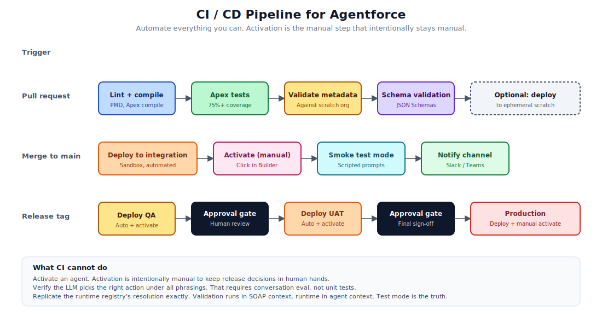

# 18. CI / CD Recipes

Concrete pipeline configurations for the most common CI providers. Copy, paste, adjust the org aliases, ship.



## What you can automate

- Linting and Apex compile
- Apex tests with coverage gates
- Metadata validation against a designated org
- JSON Schema validation for `GenAiFunction` input and output files
- Deployment to integration, QA, UAT, and production
- Smoke tests via REST and via test-mode prompts
- Notifications to a chat channel

## What you cannot automate cleanly

- Activation of the new aiAuthoringBundle agents (no first-class API yet)
- Conversation-level evaluation that scores the LLM's reasoning (do this nightly or on release)
- Permission set assignments to the agent user (org-level setup, do once per env)

## GitHub Actions

`.github/workflows/pr.yml`:

```yaml
name: PR validation

on:
  pull_request:
    branches: [main]

jobs:
  validate:
    runs-on: ubuntu-latest
    steps:
      - uses: actions/checkout@v4

      - name: Install Salesforce CLI
        run: npm install -g @salesforce/cli

      - name: Authenticate to scratch org
        env:
          SF_AUTH_URL: ${{ secrets.SF_CI_AUTH_URL }}
        run: |
          echo "$SF_AUTH_URL" > /tmp/auth.txt
          sf org login sfdx-url -f /tmp/auth.txt -a ci-org

      - name: Apex compile and validate
        run: sf project deploy validate -d force-app -o ci-org

      - name: Run Apex tests
        run: sf apex run test -o ci-org --code-coverage --result-format junit -d test-results

      - name: JSON Schema validation
        run: |
          npm install -g ajv-cli
          for f in $(find force-app/main/default/genAiFunctions -name "schema.json"); do
            ajv validate -s "$f" -d "$f" || echo "Schema invalid: $f"
          done

      - name: Action contract tests
        run: bash scripts/test-action-contracts.sh ci-org

      - name: Upload test results
        if: always()
        uses: actions/upload-artifact@v4
        with:
          name: test-results
          path: test-results/
```

`.github/workflows/deploy-integration.yml`:

```yaml
name: Deploy to integration

on:
  push:
    branches: [main]

jobs:
  deploy:
    runs-on: ubuntu-latest
    steps:
      - uses: actions/checkout@v4

      - name: Install Salesforce CLI
        run: npm install -g @salesforce/cli

      - name: Authenticate to integration sandbox
        env:
          SF_AUTH_URL: ${{ secrets.SF_INTEGRATION_AUTH_URL }}
        run: |
          echo "$SF_AUTH_URL" > /tmp/auth.txt
          sf org login sfdx-url -f /tmp/auth.txt -a integration

      - name: Deploy
        run: sf project deploy start -d force-app -o integration

      - name: Smoke test action contracts
        run: bash scripts/test-action-contracts.sh integration

      - name: Notify Slack
        if: always()
        uses: slackapi/slack-github-action@v1
        with:
          payload: |
            {
              "text": "Agentforce deploy to integration: ${{ job.status }}"
            }
        env:
          SLACK_WEBHOOK_URL: ${{ secrets.SLACK_WEBHOOK_URL }}

      - name: Reminder to activate
        if: success()
        run: |
          echo "::warning::Manual step required: open Agentforce Builder in integration org and click Activate on each agent."
```

`.github/workflows/release.yml`:

```yaml
name: Release

on:
  push:
    tags:
      - 'v*'

jobs:
  qa:
    runs-on: ubuntu-latest
    environment: qa
    steps:
      - uses: actions/checkout@v4
      - name: Install CLI
        run: npm install -g @salesforce/cli
      - name: Authenticate
        env:
          SF_AUTH_URL: ${{ secrets.SF_QA_AUTH_URL }}
        run: |
          echo "$SF_AUTH_URL" > /tmp/auth.txt
          sf org login sfdx-url -f /tmp/auth.txt -a qa
      - name: Deploy
        run: sf project deploy start -d force-app -o qa
      - name: Reminder to activate
        run: echo "::warning::Activate agents in QA org before testing."

  uat:
    needs: qa
    runs-on: ubuntu-latest
    environment:
      name: uat
      url: https://your-org.my.salesforce.com
    steps:
      - uses: actions/checkout@v4
      - name: Install CLI
        run: npm install -g @salesforce/cli
      - name: Authenticate
        env:
          SF_AUTH_URL: ${{ secrets.SF_UAT_AUTH_URL }}
        run: |
          echo "$SF_AUTH_URL" > /tmp/auth.txt
          sf org login sfdx-url -f /tmp/auth.txt -a uat
      - name: Deploy
        run: sf project deploy start -d force-app -o uat

  production:
    needs: uat
    runs-on: ubuntu-latest
    environment:
      name: production
      url: https://your-org.my.salesforce.com
    steps:
      - uses: actions/checkout@v4
      - name: Install CLI
        run: npm install -g @salesforce/cli
      - name: Authenticate
        env:
          SF_AUTH_URL: ${{ secrets.SF_PROD_AUTH_URL }}
        run: |
          echo "$SF_AUTH_URL" > /tmp/auth.txt
          sf org login sfdx-url -f /tmp/auth.txt -a production
      - name: Deploy
        run: sf project deploy start -d force-app -o production --test-level RunLocalTests
      - name: Reminder to activate
        run: echo "::warning::FINAL STEP: Activate agents in production org."
```

The `environment:` blocks in the QA, UAT, and production jobs let you set required reviewers in GitHub's environment protection rules. That's how you implement the human approval gates.

## GitLab CI

`.gitlab-ci.yml`:

```yaml
stages:
  - validate
  - test
  - deploy
  - smoke

variables:
  SF_DISABLE_AUTOUPDATE: "true"

before_script:
  - apt-get update -qq && apt-get install -y -qq nodejs npm
  - npm install -g @salesforce/cli ajv-cli

validate:
  stage: validate
  script:
    - echo "$SF_CI_AUTH_URL" > /tmp/auth.txt
    - sf org login sfdx-url -f /tmp/auth.txt -a ci-org
    - sf project deploy validate -d force-app -o ci-org
  only:
    - merge_requests

test:
  stage: test
  script:
    - sf apex run test -o ci-org --code-coverage --result-format junit -d test-results
  artifacts:
    reports:
      junit: test-results/**/*.xml
  only:
    - merge_requests

schema_validate:
  stage: validate
  script:
    - find force-app/main/default/genAiFunctions -name "schema.json" | xargs -I {} ajv validate -s {} -d {}
  only:
    - merge_requests

deploy_integration:
  stage: deploy
  script:
    - echo "$SF_INTEGRATION_AUTH_URL" > /tmp/auth.txt
    - sf org login sfdx-url -f /tmp/auth.txt -a integration
    - sf project deploy start -d force-app -o integration
  only:
    - main
  environment:
    name: integration

deploy_qa:
  stage: deploy
  script:
    - echo "$SF_QA_AUTH_URL" > /tmp/auth.txt
    - sf org login sfdx-url -f /tmp/auth.txt -a qa
    - sf project deploy start -d force-app -o qa
  when: manual
  only:
    - tags

deploy_production:
  stage: deploy
  script:
    - echo "$SF_PROD_AUTH_URL" > /tmp/auth.txt
    - sf org login sfdx-url -f /tmp/auth.txt -a production
    - sf project deploy start -d force-app -o production --test-level RunLocalTests
  when: manual
  only:
    - tags
  environment:
    name: production
```

The `when: manual` plus `only: tags` combination gives you a "click to release" gate from a tagged commit.

## Bitbucket Pipelines

`bitbucket-pipelines.yml`:

```yaml
image: node:20

pipelines:
  pull-requests:
    '**':
      - step:
          name: Validate
          script:
            - npm install -g @salesforce/cli ajv-cli
            - echo "$SF_CI_AUTH_URL" > /tmp/auth.txt
            - sf org login sfdx-url -f /tmp/auth.txt -a ci-org
            - sf project deploy validate -d force-app -o ci-org
            - sf apex run test -o ci-org --code-coverage
            - find force-app/main/default/genAiFunctions -name "schema.json" | xargs -I {} ajv validate -s {} -d {}

  branches:
    main:
      - step:
          name: Deploy to integration
          deployment: integration
          script:
            - npm install -g @salesforce/cli
            - echo "$SF_INTEGRATION_AUTH_URL" > /tmp/auth.txt
            - sf org login sfdx-url -f /tmp/auth.txt -a integration
            - sf project deploy start -d force-app -o integration

  tags:
    'v*':
      - step:
          name: Deploy to QA
          deployment: qa
          trigger: manual
          script:
            - npm install -g @salesforce/cli
            - echo "$SF_QA_AUTH_URL" > /tmp/auth.txt
            - sf org login sfdx-url -f /tmp/auth.txt -a qa
            - sf project deploy start -d force-app -o qa
      - step:
          name: Deploy to production
          deployment: production
          trigger: manual
          script:
            - npm install -g @salesforce/cli
            - echo "$SF_PROD_AUTH_URL" > /tmp/auth.txt
            - sf org login sfdx-url -f /tmp/auth.txt -a production
            - sf project deploy start -d force-app -o production --test-level RunLocalTests
```

## Helper scripts

`scripts/test-action-contracts.sh`:

```bash
#!/usr/bin/env bash
set -euo pipefail

ORG_ALIAS=${1:-ci-org}

TOK=$(sf org display -o "$ORG_ALIAS" --json | python3 -c 'import json,sys;print(json.load(sys.stdin)["result"]["accessToken"])')
INSTANCE=$(sf org display -o "$ORG_ALIAS" --json | python3 -c 'import json,sys;print(json.load(sys.stdin)["result"]["instanceUrl"])')

# List custom apex actions
ACTIONS=$(curl -s -H "Authorization: Bearer $TOK" \
    "$INSTANCE/services/data/v62.0/actions/custom/apex" \
    | python3 -c "import json,sys;[print(a['name']) for a in json.load(sys.stdin)['actions']]")

EXPECTED_ACTIONS=$(cat ci/expected-actions.txt)
MISSING=$(comm -13 <(echo "$ACTIONS" | sort) <(echo "$EXPECTED_ACTIONS" | sort))

if [ -n "$MISSING" ]; then
    echo "Missing actions:"
    echo "$MISSING"
    exit 1
fi

echo "All expected actions registered."
```

`ci/expected-actions.txt` is a checked-in list of actions that should exist in the org. The script fails the build if any are missing.

`scripts/run-agent-integration-tests.sh`:

```bash
#!/usr/bin/env bash
set -euo pipefail

ORG_ALIAS=${1:-integration}
TOK=$(sf org display -o "$ORG_ALIAS" --json | python3 -c 'import json,sys;print(json.load(sys.stdin)["result"]["accessToken"])')
INSTANCE=$(sf org display -o "$ORG_ALIAS" --json | python3 -c 'import json,sys;print(json.load(sys.stdin)["result"]["instanceUrl"])')
AGENT_ID=${AGENT_ID:?Set AGENT_ID env var}

while IFS= read -r line; do
    PROMPT=$(echo "$line" | jq -r '.prompt')
    EXPECTED_ACTION=$(echo "$line" | jq -r '.expects.action')

    RESPONSE=$(curl -s -X POST -H "Authorization: Bearer $TOK" -H "Content-Type: application/json" \
        "$INSTANCE/services/data/v62.0/einstein/agent/$AGENT_ID/conversation" \
        -d "{\"message\": \"$PROMPT\"}")

    ACTION_FIRED=$(echo "$RESPONSE" | jq -r '.actions[0].name // empty')

    if [ "$ACTION_FIRED" != "$EXPECTED_ACTION" ]; then
        echo "FAIL: Expected $EXPECTED_ACTION, got $ACTION_FIRED for prompt: $PROMPT"
        exit 1
    fi
done < ci/golden-conversations.jsonl

echo "All conversation tests passed."
```

`ci/golden-conversations.jsonl`:

```jsonl
{"prompt": "Greet me, my name is Alex", "expects": {"action": "Greet_User"}}
{"prompt": "What's the status of my order ORD-123?", "expects": {"action": "Get_Order_Status"}}
```

## Activation as a CI step

Currently no first-class API. Two unsupported approaches:

1. **A custom Connect API call** that updates the relevant `AiAuthoringBundleDefVer` record. Fragile across releases.
2. **A `sfp` (sf-plus) plugin or community tool** that wraps the activation flow. Check the community for current options.

Until Salesforce ships an official API, treat activation as the manual step at the end of the deploy pipeline. Print a loud reminder. Wire a Slack notification.

## Approval gates

Each provider has its own way of gating deployments on a human's approval:

- **GitHub:** Environment protection rules with required reviewers.
- **GitLab:** Manual jobs with approval rules.
- **Bitbucket:** Manual triggers with branch permissions.

The pattern is the same: the deploy job exists in the pipeline but does not run automatically. A human pushes the button. The button-press is logged.

For agents that touch production data, this is non-negotiable. Don't auto-deploy to production based on a tag alone.

## Failed-deploy notifications

A failed pipeline should:

1. Notify the channel.
2. Annotate the failed job with the actual error.
3. Block subsequent stages.

A common mistake: deployments that "fail soft" (the pipeline goes green even though the deploy errored). Watch for this. Salesforce CLI exit codes are not always intuitive.

## When CI is wrong

Sometimes the CI is the problem. Things to check:

- Stale auth token. Refresh the secret.
- Recent Salesforce CLI release that broke a flag. Pin the version.
- The org is in a maintenance window. Try again later.
- The deploy is hitting a metadata limit. Split the deploy.
- A subscriber package install is in progress. Wait.

Treat CI as code. When it breaks, fix it before deploying around it.

## References

- [Salesforce CLI command reference](https://developer.salesforce.com/docs/atlas.en-us.sfdx_cli_reference.meta/sfdx_cli_reference/cli_reference_top.htm)
- [`sf project deploy/retrieve`](https://developer.salesforce.com/docs/atlas.en-us.sfdx_cli_reference.meta/sfdx_cli_reference/cli_reference_project_commands_unified.htm)
- [GitHub Actions documentation](https://docs.github.com/en/actions)
- [GitLab CI documentation](https://docs.gitlab.com/ee/ci/)
- [Bitbucket Pipelines documentation](https://support.atlassian.com/bitbucket-cloud/docs/get-started-with-bitbucket-pipelines/)
- [Salesforce DevOps Center](https://help.salesforce.com/s/articleView?id=sf.devops_center_overview.htm)
